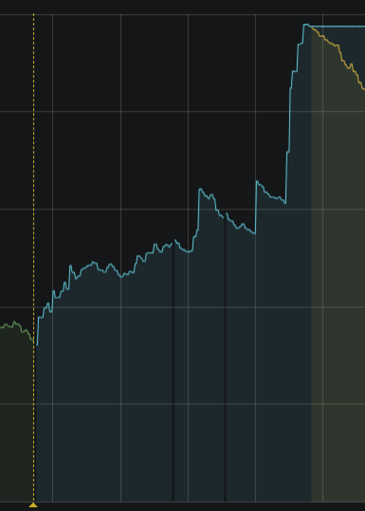

## Лекция 8. Брокеры сообщений. Трассировка. Метрики. Нагрузочное тестирование.    

### OZON

### Москва, 2021


---

### Лекции

1. <span style="color:gray">Введение. Рабочее окружение. Структура программы. Инструментарий.</span>
2. <span style="color:gray">Базовые конструкции и операторы. Встроенные типы и структуры данных.</span>
3. <span style="color:gray">Структуры данных, отложенные вызовы, обработка ошибок и основы тестирования</span>
4. <span style="color:gray">Интерфейсы, моки и тестирование с ними </span>
5. <span style="color:gray">Асинхронные сущности и паттерны в Go</span>
6. <span style="color:gray">Protobuf и gRPC</span>
7. <span style="color:gray">Работа с БД в Go</span>
8. Брокеры сообщений. Трассировка. Метрики. Нагрузочное тестирование.

---

### Темы

Сегодня мы поговорим про:

1. Брокеры сообщений: зачем и как с этим взаимодействовать (на примере Apache Kafka). <!-- .element: class="fragment" -->
2. Трассировка: когда логов недостаточно. <!-- .element: class="fragment" -->
3. Метрики: биение сердца вашего сервиса. <!-- .element: class="fragment" -->
4. Нагрузочное тестирование: как стрелять по сервису. <!-- .element: class="fragment" -->

---

### Обозначения

* 📽️ - посмотри воркшоу
* ⚗️ - проведи эксперимент
* 🔬 - изучи внимательно
* 📖 - прочитай документация
* 🪙 - подумай о сложности
* 🐞 - запомни ошибку
* 🔨 - запомни решение
* 🏔️ - обойди камень предкновенья
* ⏰ - сделай перерыв
* 🏡 - попробуй дома
* 💡 - обсуди светлые идеи
* 🙋 - задай вопрос
* ⚡ - запомни панику


---

### Что такое лог?

А вообще что такое лог?

Лог -- это структура данных, в которую можно добавлять только в конец. <!-- .element: class="fragment" --> 

Из лога можно прочесть определённое сообщение, только зная его смещение относительно начала лога. <!-- .element: class="fragment" -->

С точки зрения потребителя -- брокеры сообщений представляют возможность работы с логами, которые в их мире называются очередями сообщений. <!-- .element: class="fragment" -->

---

### Что такое брокер сообщений?

В идеальном мире данные не теряются, всё надёжно, нет ни единого разрыва.

В реальном есть большое количество проблем. Каких? <!-- .element: class="fragment" -->

1. Может пропасть сетевая связанность <!-- .element: class="fragment" -->
2. Могут записаться битые данные <!-- .element: class="fragment" -->
3. Сообщение может уйти не туда <!-- .element: class="fragment" -->
4. Сообщений может стать слишком много <!-- .element: class="fragment" -->
5. Какой-то из сервисов может внезапно умереть <!-- .element: class="fragment" -->

---

### Что такое Kafka?

ПО, реализующее очередь сообщений:
* распределённое <!-- .element: class="fragment" -->
* горизонтально масштабируемое <!-- .element: class="fragment" -->
* отказоустойчивое <!-- .element: class="fragment" -->
* долговечное (пока мы не решим очистить) <!-- .element: class="fragment" -->

Разработано LinkedIn, отдано для развития Apache Foundation.  <!-- .element: class="fragment" -->

---

### Как выглядит оно в общем?


---


### Как выглядит оно в общем?


Для того, чтобы Kafka работала в кластере, ей требуется вспомогательный сервис Zookeeper. 

Zookeeper -- хранит метаданные и является координатором для нескольких инстансов Kafka. <!-- .element: class="fragment" -->

---

### Как оно всё внутри?


---

### Как оно всё внутри?

События делятся логически на некоторые именованные топики.

У топика есть свои параметры: <!-- .element: class="fragment" -->

1. объем хранимых данных и/или их возраст (retention.bytes, retention.ms) -- то есть когда мы будем чистить топик от старых сообщений; <!-- .element: class="fragment" -->
2. фактор избыточности данных (replication factor) -- сколько копий сообщения у нас есть в кластере; <!-- .element: class="fragment" -->
3. максимальный размер одного сообщения (max.message.bytes); <!-- .element: class="fragment" -->
4. минимальное число согласованных реплик, при котором в топик можно будет записать данные (min.insync.replicas); <!-- .element: class="fragment" -->
5. и другие; <!-- .element: class="fragment" -->

---

### Как оно всё внутри?

В свою очередь каждый топик разбивается на одну и более партицию (partition). Именно в партиции в итоге попадают события. 

Если в кластере более одного брокера, то партиции будут распределены по всем брокерам равномерно (насколько это возможно), что позволит масштабировать нагрузку на запись и чтение в один топик сразу на несколько брокеров. <!-- .element: class="fragment" -->

В итоге механизм патриций позволяет обеспечивать масштабируемость и отказоустойчивость.  <!-- .element: class="fragment" -->


---

### Что такое producer?

Producer отправляет события в топик. Это может быть какой-то сервис, либо даже отдельный скрипт.

Каждое такое событие представляет из себя пару ключ-значение.  <!-- .element: class="fragment" -->

Ключ может быть не задан, тогда события распределяются между патрициями по очереди и может теряться их упорядоченность.  <!-- .element: class="fragment" -->

Если ключ задан, то от него берётся хэш и события распределяются с сохранением порядка в рамках одной партиции. <!-- .element: class="fragment" -->

---

### Что такое consumer?

Consumer это опять же некоторый сервис, который в данном случае потребляет приходящие события. Он может быть подписан на несколько топиков.

Важным параметром для consumer является offset, который показывает как далеко мы прошли по топику.  <!-- .element: class="fragment" -->

Offset может обновляться автоматически Kafka (enable.auto.commit = true) или по сообщению с консьюмера. В проде обычно используется второй вариант. <!-- .element: class="fragment" -->

Предполагается, что offset всегда будет расти. <!-- .element: class="fragment" -->

Consumer могут объединяться в группы. У каждый группы свой offset. <!-- .element: class="fragment" -->

---

### Как оно всё внутри?


---

### Как поднять кластер Kafka?

Разумеется, через docker.

```yaml
version: "3"

services:
  zookeeper:
    image: confluentinc/cp-zookeeper
    ports:
      - "2181:2181"
    environment:
      zk_id: "1"
      ZOOKEEPER_CLIENT_PORT: 32181
      ZOOKEEPER_TICK_TIME: 2000
      ZOOKEEPER_SYNC_LIMIT: 2


  kafka:
    image: confluentinc/cp-kafka
    depends_on:
      - zookeeper
    ports:
      - "127.0.0.1:9094:9094"
    environment:
      KAFKA_ZOOKEEPER_CONNECT: "zookeeper:32181"
      KAFKA_LISTENERS: INTERNAL://kafka:9092,OUTSIDE://kafka:9094
      KAFKA_ADVERTISED_LISTENERS: INTERNAL://kafka:9092,OUTSIDE://localhost:9094
      KAFKA_LISTENER_SECURITY_PROTOCOL_MAP: INTERNAL:PLAINTEXT,OUTSIDE:PLAINTEXT
      KAFKA_INTER_BROKER_LISTENER_NAME: INTERNAL
      KAFKA_OFFSETS_TOPIC_REPLICATION_FACTOR: 1

```

Можно больше брокеров, но они все не уместились. Для подключения нужно знать адреса всех брокеров.

---


---

### Какие библиотеки на go есть для Kafka?

* Sarama, которая на сегодняшний день является самой популярной, но с которой довольно трудно работать. Он плохо документирован, API предоставляет низкоуровневые концепции протокола Кафки и не поддерживает последние функции Go, такие как контексты. Также передает все значения в качестве указателей, что приводит к большому количеству динамических выделений памяти, более частым сборкам мусора и более высокому использованию памяти.

https://github.com/Shopify/sarama

---

### Какие библиотеки на go есть для Kafka?

* Сonfluent-kafka-go-это оболочка на основе cgo вокруг librdkafka, что означает, что она вводит зависимость библиотеки C от всего кода Go, использующего пакет. Он имеет гораздо лучшую документацию, чем sarama, но все еще не поддерживает контексты Go.

https://github.com/confluentinc/confluent-kafka-go

---

### Какие библиотеки на go есть для Kafka?


* goka - это более поздний клиент Kafka для Go, который фокусируется на определенном шаблоне использования. Он предоставляет абстракции для использования Кафки в качестве шины передачи сообщений между службами, а не упорядоченного журнала событий, но это не типичный случай использования Кафки для нас в сегменте. Пакет также зависит от Sarama для всех взаимодействий с Кафкой.

https://github.com/lovoo/goka

---

### Пример работы с библиотекой Sarama. Consumer

```go
package main

import (
	"fmt"

	"github.com/Shopify/sarama"
)

func subscribe(topic string, consumer sarama.Consumer) {
	partitionList, err := consumer.Partitions(topic) //get all partitions on the given topic
	if err != nil {
		fmt.Println("Error retrieving partitionList ", err)
	}
	initialOffset := sarama.OffsetOldest //get offset for the oldest message on the topic

	for _, partition := range partitionList {
		pc, _ := consumer.ConsumePartition(topic, partition, initialOffset)

		go func(pc sarama.PartitionConsumer) {
			for message := range pc.Messages() {
				messageReceived(message)
			}
		}(pc)
	}
}

func messageReceived(message *sarama.ConsumerMessage) {
	saveMessage(string(message.Value))
}
```


---

### Пример работы с библиотекой. Producer

```go
package main

import "github.com/Shopify/sarama"

var brokers = []string{"127.0.0.1:9094"}

func newProducer() (sarama.SyncProducer, error) {
	config := sarama.NewConfig()
	config.Producer.Partitioner = sarama.NewRandomPartitioner
	config.Producer.RequiredAcks = sarama.WaitForAll
	config.Producer.Return.Successes = true
	producer, err := sarama.NewSyncProducer(brokers, config)

	return producer, err
}

func prepareMessage(topic, message string) *sarama.ProducerMessage {
	msg := &sarama.ProducerMessage{
		Topic:     topic,
		Partition: -1,
		Value:     sarama.StringEncoder(message),
	}

	return msg
}
```

---

### Пример работы с библиотекой. Main.go


```go
package main

import (
	"fmt"
	"html"
	"log"
	"net/http"

	"github.com/Shopify/sarama"
)

const topic = "sample-topic"

func main() {
	producer, err := newProducer()
	if err != nil {
		fmt.Println("Could not create producer: ", err)
	}

	consumer, err := sarama.NewConsumer(brokers, nil)
	if err != nil {
		fmt.Println("Could not create consumer: ", err)
	}

	subscribe(topic, consumer)

	http.HandleFunc("/", func(w http.ResponseWriter, r *http.Request) { fmt.Fprint(w, "Hello Sarama!") })
```

---

### Пример работы с библиотекой. Main.go
```go
	http.HandleFunc("/save", func(w http.ResponseWriter, r *http.Request) {
		defer r.Body.Close()
		r.ParseForm()
		msg := prepareMessage(topic, r.FormValue("q"))
		partition, offset, err := producer.SendMessage(msg)
		if err != nil {
			fmt.Fprintf(w, "%s error occured.", err.Error())
		} else {
			fmt.Fprintf(w, "Message was saved to partion: %d.\nMessage offset is: %d.\n", partition, offset)
		}
	})

	http.HandleFunc("/retrieve", func(w http.ResponseWriter, r *http.Request) { fmt.Fprint(w, html.EscapeString(getMessage())) })

	log.Fatal(http.ListenAndServe(":8081", nil))
}
```

---

### Больше про Kafka

1. Apache Kafka: Что это и как она изменит архитектуру вашего приложения https://www.youtube.com/watch?v=nkYW7YqJYmE
2. Apache Kafka, открытый базовый курс: https://www.youtube.com/playlist?list=PL8D2P0ruohOAR7DAkEjhOqlQreg9rxBMu

---

### Что такое метрики?

Метрики -- это некоторые показатели, которые сообщает ваш сервис в режиме реального времени. Они показывают насколько сервис здоровый, как эффективно он обрабатывает сообщения.

Метрики пишутся в определённое хранилище, которое хранит их значения относительно времени. Это ещё один вид БД, который оперирует именно временными последовательностями. <!-- .element: class="fragment" -->

---

### Какие бывают типы метрик?

* счётчик (counter) — хранит значения, которые увеличиваются с течением времени (например, количество запросов к серверу); <!-- .element: class="fragment" -->
* шкала (gauge) — хранит значения, которые с течением времени могут как увеличиваться, так и уменьшаться (например, объём используемой оперативной памяти или количество операций ввода-вывода); <!-- .element: class="fragment" -->
* гистограмма (histogram) — хранит информацию об изменении некоторого параметра в течение определённого промежутка (например, общее количество запросов к серверу в период с 11 до 12 часов и количество запросов к этому же серверов в период с 11.30 до 11.40); <!-- .element: class="fragment" -->
* сводка результатов (summary) — как и гистограмма, хранит информацию об изменении значения некоторого параметра за временной интервал, но также позволяет рассчитывать квантили для скользящих временных интервалов. <!-- .element: class="fragment" -->

---

### Что такое метрики?

У значений метрик могут проставляться разные метки (labels). Пример метрики:

http_response_code -- её значение -- количество . Она имеет тип counter. <!-- .element: class="fragment" -->

Её метки: browser, response_code, time_grade, handle. <!-- .element: class="fragment" -->

Выборки можно проводить относительно каждой метки. То есть можно выбрать количество запросов, которые вернули 404 или количество запросов к определённой ручке, которые выполнялись за определённое время. <!-- .element: class="fragment" -->

---

### Что такое метрики?

Метки должны иметь малое (не более 30) количество разных значений. К примеру для time_grade: 
 * 0-100ms
 * 100-200ms
 * 200-500ms
 * 500-100ms
 * 1s-5s
 * 5s-10s
 * и т.д.

---

### Что такое метрики?

При проектировании метрик надо помнить, что метрики собираются пока сервис работает. Как сервис умирает или по какой-то другой причине прекращает транслировать метрику -- могут быть сайд-эффекты. 

К примеру: 




---

### Prometheus

Prometheus -- система, объединяющая мониторинг и сбор данных, а также систему для хранения метрик.

Это внешний сервис, который собирает метрики от сервисов и агрегирует их внутри себя. <!-- .element: class="fragment" -->

Он имеет свой встроенный язык запросов PromQL. <!-- .element: class="fragment" -->

---

### PromQL

```bash
>> node_load1

node_load1{instance="localhost:9100",job="node"} = 0.96
node_load1{instance="anotherhost:9100",job="node"} = 0.44
```

* node_load1 — имя метрики,
* instance и job — имена меток,
* localhost:9100 и node — соответствующие значения меток
* 0.96 — значение метрики.


```bash
>> node_load1{instance!='localhost:9100'}

node_load1{instance="anotherhost:9100",job="node"} = 0.96
```


---

### PromQL

```bash
>> node_filesystem_avail_bytes
node_filesystem_avail_bytes{device="/dev/nvme0n1p1",fstype="vfat",instance="localhost:9100",
job="node",mountpoint="/boot"}  = 143187968
node_filesystem_avail_bytes{device="/dev/nvme0n1p2",fstype="ext4",instance="localhost:9100",
job="node",mountpoint="/"} = 340473708544
node_filesystem_avail_bytes{device="/dev/sda1",fstype="ext4",instance="anotherhost:9100",
job="node",mountpoint="/"} = 429984710656
node_filesystem_avail_bytes{device="run",fstype="tmpfs",instance="localhost:9100",
job="node",mountpoint="/run"} = 4120506368
node_filesystem_avail_bytes{device="tmpfs",fstype="tmpfs",instance="localhost:9100",
job="node",mountpoint="/tmp"} = 4109291520
node_filesystem_avail_bytes{device="tmpfs",fstype="tmpfs",instance="anotherhost:9100",
job="node",mountpoint="/run"} = 104542208
```

---

### PromQL

```bash
>> node_filesystem_avail_bytes / node_filesystem_size_bytes * 100
{device="/dev/nvme0n1p1",fstype="vfat",instance="localhost:9100",job="node",mountpoint="/boot"} = 54.17850016466805
{device="/dev/nvme0n1p2",fstype="ext4",instance="localhost:9100",job="node",mountpoint="/"} = 73.94176693455515
{device="/dev/sda1",fstype="ext4",instance="anotherhost:9100",job="node",mountpoint="/"} = 68.54660550632083
{device="run",fstype="tmpfs",instance="localhost:9100",job="node",mountpoint="/run"} = 99.96800174897272
{device="tmpfs",fstype="tmpfs",instance="localhost:9100",job="node",mountpoint="/tmp"} = 99.69591724179051
{device="tmpfs",fstype="tmpfs",instance="anotherhost:9100",job="node",mountpoint="/run"} = 9

```

---

### PromQL

```bash
>> node_cpu_seconds_total

27687.16node_cpu_seconds_total{cpu="0",instance="localhost:9100",job="node",mode="idle"} = 349.98
node_cpu_seconds_total{cpu="0",instance="localhost:9100",job="node",mode="iowait"} = 0
node_cpu_seconds_total{cpu="0",instance="localhost:9100",job="node",mode="irq"} = 4.5
node_cpu_seconds_total{cpu="0",instance="localhost:9100",job="node",mode="nice"} = 342.47
node_cpu_seconds_total{cpu="0",instance="localhost:9100",job="node",mode="softirq"} = 0
node_cpu_seconds_total{cpu="0",instance="localhost:9100",job="node",mode="steal"} = 734.43
node_cpu_seconds_total{cpu="0",instance="localhost:9100",job="node",mode="system"} = 2386.23
node_cpu_seconds_total{cpu="0",instance="localhost:9100",job="node",mode="user"} = 27613.56
node_cpu_seconds_total{cpu="1",instance="localhost:9100",job="node",mode="idle"} = 328.26

```

---

### PromQL

```bash
>> max by (instance) (node_cpu_seconds_total)
{instance="localhost:9100"} = 18309.45
{instance="anotherhost:9100"} = 3655352.98

>> max by (instance, cpu) (node_cpu_seconds_total)
{cpu="3",instance="localhost:9100"} = 17623.34
{cpu="0",instance="localhost:9100"} = 18295.97
{cpu="0",instance="anotherhost:9100"} = 3529407.76
{cpu="1",instance="localhost:9100"} = 18252.21
{cpu="1",instance="anotherhost:9100"} = 3655379.15
{cpu="2",instance="localhost:9100"} = 18334

>> max without (mode) (node_cpu_seconds_total)
{cpu="1",instance="anotherhost:9100",job="node"} = 3655736.46
{cpu="2",instance="localhost:9100",job="node"} = 18752.74
{cpu="3",instance="localhost:9100",job="node"} = 18022.19
{cpu="0",instance="localhost:9100",job="node"} = 18716.18
{cpu="0",instance="anotherhost:9100",job="node"} = 3529779.38
{cpu="1",instance="localhost:9100",job="node"} = 18670.74
```

---

### Собираем всё вместе

Нам потребуется конфигурационный файл ```prometheus.yml```.

```yaml
global:
  scrape_interval:     10s
  
scrape_configs:
  - job_name: 'node'
    static_configs:
    - targets: ['192.168.100.17:9100']
```

* 192.168.100.17 -- IP адрес компьютера, где запущен наш сервис, чтобы к нему можно было достучаться из докера <!-- .element: class="fragment" -->
* 9100 -- порт сервиса, который будет вовзращать значения метрик <!-- .element: class="fragment" -->


---

### Docker-compose

```yaml
version: "3"

services:
  prometheus:
    image: prom/prometheus
    ports:
      - "9090:9090"
    volumes:
      - "./prometheus.yml:/etc/prometheus/prometheus.yml"
```

---

### Использование из GO

```go
package main

import (
	"net/http"

	"github.com/prometheus/client_golang/prometheus/promhttp"
)

func main() {

	http.Handle("/metrics", promhttp.Handler())
	
	// ...

	println("listening..")
	http.ListenAndServe(":9100", nil)
}

```

---

### Использование из GO

---

```go
// create a new counter vector
var getBookCounter = prometheus.NewCounterVec(
	prometheus.CounterOpts{
		Name: "http_request_get_books_count", // metric name
		Help: "Number of get_books request.",
	},
	[]string{"status"}, // labels
)

func init() {
    // must register counter on init
	prometheus.MustRegister(getBookCounter)
}

```

---

### Использование из GO

```go
func bookHandler(w http.ResponseWriter, r *http.Request) {
	var status string
	defer func() {
        // increment the counter on defer func
		getBookCounter.WithLabelValues(status).Inc()
	}()

	books, err := getBooks(r.FormValue("category"))
	if err != nil {
		status = "error"
		w.Write([]byte("something's wrong: " + err.Error()))
		return
	}

	resp, err := json.Marshal(books)
	if err != nil {
		status = "error"
		w.Write([]byte("something's wrong: " + err.Error()))
		return
	}

	status = "success"
	w.Write(resp)
}

```

---

### Opentracing и Jaeger

Трейс позволяет понять к каким другим сервисам, БД и прочему обращался микросервис.

Трейс может проходить через несколько сервисов, каждый из которых будет обогащать его своими данными. <!-- .element: class="fragment" -->

В трейс можно записать логи и ключи, по которым можно найти нужные трейсы. <!-- .element: class="fragment" -->

Opentracing -- это свободное API для сбора трейсов. <!-- .element: class="fragment" --> https://github.com/opentracing/opentracing-go <!-- .element: class="fragment" -->

Jaeger -- это Opentracing-совместимый сборщик трейсов. <!-- .element: class="fragment" --> https://github.com/jaegertracing/jaeger-client-go  <!-- .element: class="fragment" -->


---

### Подключение к проекту

```go
import (
    "log"
    "os"

    opentracing "github.com/opentracing/opentracing-go"
    "github.com/uber/jaeger-lib/metrics"

    "github.com/uber/jaeger-client-go"
    jaegercfg "github.com/uber/jaeger-client-go/config"
    jaegerlog "github.com/uber/jaeger-client-go/log"
)

...

func main() {
    // Sample configuration for testing. Use constant sampling to sample every trace
    // and enable LogSpan to log every span via configured Logger.
    cfg := jaegercfg.Configuration{
        ServiceName: "your_service_name",
        Sampler:     &jaegercfg.SamplerConfig{
            Type:  jaeger.SamplerTypeConst,
            Param: 1,
        },
        Reporter:    &jaegercfg.ReporterConfig{
            LogSpans: true,
        },
    }

    // Example logger and metrics factory. Use github.com/uber/jaeger-client-go/log
    // and github.com/uber/jaeger-lib/metrics respectively to bind to real logging and metrics
    // frameworks.
    jLogger := jaegerlog.StdLogger
    jMetricsFactory := metrics.NullFactory

    // Initialize tracer with a logger and a metrics factory
    tracer, closer, err := cfg.NewTracer(
        jaegercfg.Logger(jLogger),
        jaegercfg.Metrics(jMetricsFactory),
    )
    // Set the singleton opentracing.Tracer with the Jaeger tracer.
    opentracing.SetGlobalTracer(tracer)
    defer closer.Close()

    // continue main()
}

```

---

### Запуск трейса

```go
import (
    opentracing "github.com/opentracing/opentracing-go"
)

...

tracer := opentracing.GlobalTracer()

span := tracer.StartSpan("say-hello")
println(helloStr)
span.Finish()

```

---

### Создание подтрейса

```go
import (
    opentracing "github.com/opentracing/opentracing-go"
)

...

tracer := opentracing.GlobalTracer()

parentSpan := tracer.StartSpan("parent")
defer parentSpan.Finish()

...

// Create a Child Span. Note that we're using the ChildOf option.
childSpan := tracer.StartSpan(
    "child",
    opentracing.ChildOf(parentSpan.Context()),
)
defer childSpan.Finish()
```

---

### Встраивание в context. Клиент.

```go
import (
    "net/http"

    opentracing "github.com/opentracing/opentracing-go"
    "github.com/opentracing/opentracing-go/ext"
)

...

tracer := opentracing.GlobalTracer()

clientSpan := tracer.StartSpan("client")
defer clientSpan.Finish()

url := "http://localhost:8082/publish"
req, _ := http.NewRequest("GET", url, nil)

// Set some tags on the clientSpan to annotate that it's the client span. The additional HTTP tags are useful for debugging purposes.
ext.SpanKindRPCClient.Set(clientSpan)
ext.HTTPUrl.Set(clientSpan, url)
ext.HTTPMethod.Set(clientSpan, "GET")

// Inject the client span context into the headers
tracer.Inject(clientSpan.Context(), opentracing.HTTPHeaders, opentracing.HTTPHeadersCarrier(req.Header))
resp, _ := http.DefaultClient.Do(req)
```

---

### Встраивание в context. Сервер.

```go
import (
    "log"
    "net/http"

    opentracing "github.com/opentracing/opentracing-go"
    "github.com/opentracing/opentracing-go/ext"
)

func main() {

    // Tracer initialization, etc.

    ...

    http.HandleFunc("/publish", func(w http.ResponseWriter, r *http.Request) {
        // Extract the context from the headers
        spanCtx, _ := tracer.Extract(opentracing.HTTPHeaders, opentracing.HTTPHeadersCarrier(r.Header))
        serverSpan := tracer.StartSpan("server", ext.RPCServerOption(spanCtx))
        defer serverSpan.Finish()
    })

    log.Fatal(http.ListenAndServe(":8082", nil))
}
```


---


### Нагрузочное тестирование

Нагрузочное тестирование (англ. load testing) — подвид тестирования производительности, сбор показателей и определение производительности и времени отклика программно-технической системы или устройства в ответ на внешний запрос с целью установления соответствия требованиям, предъявляемым к данной системе (устройству).

Оно позволяет понять какие вообще есть возможности есть у нашего сервиса, его узкие места. <!-- .element: class="fragment" -->

* Танк -- сервис, который стреляет из пушки снарядом и собирает статистику о выстреле. <!-- .element: class="fragment" -->
* Пушка -- скрипт или программа, которая генерирует нагрузку на сервис. <!-- .element: class="fragment" -->
* Снаряд -- собственно нагрузка на сервис (отделньый запрос или сценарий). <!-- .element: class="fragment" -->

---

### Написание пушки

В качестве пушки мы будем использовать Yandex.Pandora. 

Этот фреймворк позволяет делать кастомные пунки на Go, которые обладают высокой производительностью и позволяют обстреливать сервис. <!-- .element: class="fragment" -->

Пример такой пушки: https://github.com/yandex/pandora/blob/develop/examples/custom_pandora/custom_main.go <!-- .element: class="fragment" -->


---

### Проведение стрельб

Для проведения стрельб требуется конфиг определённого формата:

```yaml
pools:
- gun:
    type: my-custom-gun-name
    target: example.com:80

  ammo:
    type: my-custom-provider-name
    source: # You may just write file path here. Or stdin.
      type: inline
      data: |
        {"url": "url1", "queryParam": "query1"}
        {"url": "url2", "queryParam": "query2"}
  result:
    type: json
    sink: stdout # Just for interactivity print result to stdout. Usually file used here.

  rps:
    - {duration: 2s, type: line,  from: 1, to: 5}
    - {duration: 3s, type: const, ops: 5}
    - {duration: 2s, type: line,  from: 5, to: 1}
  startup:
    type: once
    times: 5

log:
  level: debug
```

---

### Проведение стрельб

Для запуска надо указать файл:

```bash
pandora myconfig.yaml
```

Логи можно визуализировать через Yandex.Tank, либо посмотреть метрики серовиса в графане.